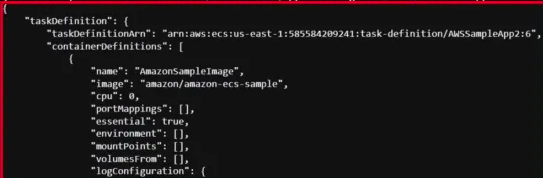

# DESCRIPTION

Here in this template, you will learn about the concept of creating ECS task Definition and DeRegister it. 

---

#### Prerequiste

* Install Python
* AWS Configure

### Steps 

1. Open the folder in your terminal or any supported tool.
2. Run the following commands:-

`python3 create-ecs-task-definition.py`

`python3 deregister-task-definition-boto3.py`

---

### Outputs  

---
